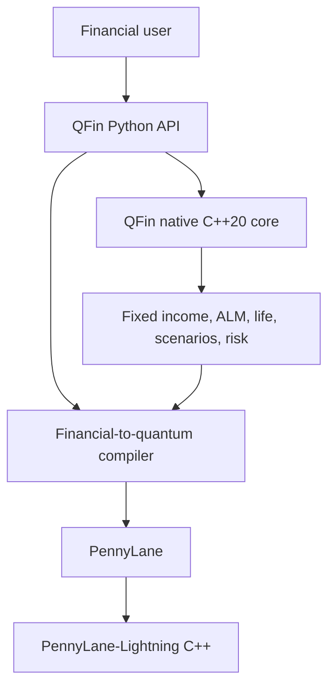

# QFin

[](https://github.com/venkatkota2/QFin/actions/workflows/ci.yml)

QFin is an experimental finance-specific modelling and compilation framework
for quantum computing. Users work with financial objects in Python. QFin maps
supported problems into classical calculations, quantum representations,
algorithms, circuits, and PennyLane devices while reporting which stages are
actually implemented.

Version `0.6.0` adds multi-factor, multi-period ALM and richer life-insurance
foundations. Economic paths now cover rates, credit spreads, equity, inflation,
mortality, and lapse; native kernels roll portfolios through reinvestment and
rebalancing and project grouped term, participating, universal-life, and
annuity model points through active/disabled/dead states. Their scenario loss
distributions feed the 0.5 tail-probability, VaR, and CVaR compiler boundary.
QFin-owned C++20 finance kernels and the PennyLane-Lightning simulator remain
separate components.

## Architecture



The two C++ components have separate responsibilities:

| Component | Responsibility |
| --- | --- |
| QFin C++ | Finance-specific cash-flow valuation, scenario repricing, actuarial projection, yield solving, and risk aggregation |
| PennyLane-Lightning C++ | State-vector simulation, quantum gate application, measurement, and circuit execution |

QFin does not implement a state-vector simulator and does not duplicate
PennyLane-Lightning.

## Install

```bash
python -m venv .venv
source .venv/bin/activate       # Windows: .venv\Scripts\activate
python -m pip install -e ".[quantum]"
```

Python 3.11 or newer is supported. Wheels produced by QFin include the native
extension without requiring the installer to run CMake. A source/editable build
needs a C++20 compiler; the build backend provisions CMake and pybind11
automatically.
NumPy/SciPy reference paths remain available through `engine="numpy"` and are
used as correctness oracles and for workloads where a native boundary crossing
does not help.

The distribution is named `qfin-quantum` because `qfin` is already occupied on
PyPI; the Python import remains `qfin`.

Inspect capabilities:

```python
import qfin

print(qfin.system_info())
# {
#   'native_extension': True,
#   'native_backend': 'qfin-native',
#   'native_cpp_standard': 'C++20',
#   'native_compiler': '<compiler id/version>',
#   'pennylane_lightning': True,
#   'preferred_quantum_device': 'lightning.qubit',
#   ...
# }
```

## Fixed income

```python
import qfin

curve = qfin.YieldCurve(
    times=[0, 1, 5, 10, 30],
    zero_rates=[0.02, 0.025, 0.03, 0.035, 0.04],
)
bonds = [
    qfin.FixedRateBond(maturity=5, coupon_rate=0.03, frequency=2),
    qfin.FixedRateBond(maturity=10, coupon_rate=0.04, frequency=2),
]

result = qfin.price_bonds(bonds, curve)
print(result.dirty_prices)
print(result.macaulay_duration)
print(result.convexity)
print(result.dv01)
```

The fixed-income layer supports fixed and zero-coupon cash flows, final stubs,
clean/dirty prices, accrued interest, curve pricing, price from yield, yield
from price, Macaulay/modified duration, convexity, DV01, and batch execution.
Rates are continuously compounded in `YieldCurve`; yield-to-maturity functions
use the bond's nominal coupon frequency.

## Asset-liability modelling

```python
import numpy as np

assets = qfin.AssetPortfolio(
    bonds=bonds,
    quantities=[20, 15],
    equity_value=5_000,
    cash_value=500,
)
liabilities = qfin.LiabilityPortfolio.from_arrays(
    times=[3, 8, 15],
    amounts=[1_000, 2_000, 3_000],
    inflation_linkage=[0.25, 0.5, 1.0],
)
alm = qfin.ALMModel(assets=assets, liabilities=liabilities, curve=curve)

base = alm.evaluate()
print(base.funding_ratio, base.duration_gap, base.convexity_gap)

scenarios = qfin.RateScenarioSet.parallel(curve, [-0.01, 0.0, 0.01])
stressed = alm.run_scenarios(scenarios, chunk_size=128)
print(stressed.surplus)

economic_paths = qfin.EconomicScenarioSet.correlated_gaussian(
    curve,
    scenario_count=1_000,
    periods=10,
    correlation=np.eye(6),
    standard_deviations=[0.0075, 0.003, 0.18, 0.012, 0.08, 0.12],
    means=[0, 0, 0.06, 0.025, 0, 0],
    seed=11,
)
paths = alm.project_paths(
    economic_paths,
    strategy=qfin.RebalancingStrategy(target_equity_weight=0.30),
)
print(paths.funding_ratio[:, -1])
```

`duration_gap` uses the standard immunization definition
`D_assets - (L/A) D_liabilities`. Scenario execution accepts node-aligned rate
shock matrices and includes parallel, steepener/flattening, and triangular
key-rate constructors. `EconomicScenarioSet` adds probability-aware economic
paths. One-period revaluation reports rates/spread/equity/inflation attribution
and sensitivities; multi-period execution models bond roll-down, reinvestment,
short-rate cash accrual, equity returns, liability payments, inflation linkage, target-weight
rebalancing, and transaction costs. Chunks bound temporary memory and native
kernels return portfolio aggregates without materializing a scenario ×
instrument × period cube.

## Life projection

```python
import numpy as np

ages = np.arange(20, 121, dtype=float)
qx = np.minimum(0.0002 * np.exp(0.075 * (ages - 20)), 1.0)
mortality = qfin.MortalityTable(ages, qx)
policies = qfin.PolicyModelPointSet(
    [
        qfin.LifePolicy(40, 250_000, 700, 20),
        qfin.LifePolicy(
            65,
            0,
            0,
            20,
            product_type="annuity",
            annual_benefit=12_000,
        ),
    ],
    counts=[5_000, 2_000],
)
assumptions = qfin.LifeAssumptionSet(
    mortality=mortality,
    curve=curve,
    lapse_rate=0.04,
    expense_per_policy=30,
    disability_rate=0.005,
    recovery_rate=0.20,
)

projection = qfin.project_liabilities(policies, assumptions)
print(projection.present_value)
print(projection.expected_benefits)
```

The annual-step foundation supports term, participating, universal-life, and
annuity model points; exact grouping with exposure counts; active, disabled,
and dead states; recovery, lapse, expenses, credited account values, bonuses,
surrenders, inflation-linked benefits, product PVs, sensitivities, and
conversion into an ALM liability portfolio. Premiums and expenses occur at the
start of each policy year and benefits at year end; mortality precedes
disability/recovery and lapse. `project_liability_scenarios` applies economic
and biometric paths while chunking both axes and returns scenario aggregates
that map directly into `LossDistribution`.

This is a rigorous extensible foundation, not a Prophet/AXIS/PathWise
replacement. Product semantics are intentionally simple and explicit.
Standalone mortality-table interpolation remains in NumPy because it
benchmarks faster there; C++ accelerates policy-by-year and
scenario-by-model-point-by-year loops.

See [docs/alm-life-0.6.md](docs/alm-life-0.6.md) for factor shapes, projection
ordering, product semantics, memory behavior, and explicit limitations.

## ALM to quantum risk

```python
scenario_result = alm.run_scenarios(scenarios)
losses = scenario_result.loss_distribution()
risk = qfin.CVaR(losses, confidence=0.995)
compiled = qfin.compile(risk, target_error=1.0)

classical = compiled.run()
quantum = compiled.run_quantum(
    shots=4_000,
    schedule=(0, 1, 2, 4),
    seed=7,
)

print(classical.cvar)
print(quantum.expected_shortfall)
print(quantum.value_at_risk)
print(quantum.resources.to_dict())
print(qfin.problem_capabilities(risk).to_dict())
```

`compiled.run()` remains the stable NumPy/QFin-native validation path.
`run_quantum()` executes the experimental PennyLane workflow: probability-tree
state preparation, MLAE CDF objectives, hybrid VaR threshold search, and an
MLAE tail-excess objective for CVaR. `TailProbability`, `VaR`, and `CVaR` are
separate public problem types.

The first empirical loader and objective multiplexer require
`O(2**data_qubits)` rotations. QFin reports that cost explicitly and makes no
quantum-advantage claim. See [docs/quantum-risk.md](docs/quantum-risk.md) for
the equations, confidence-interval semantics, and limitations.

Correlated multi-factor losses can be built with an explicit dependence model:

```python
import numpy as np
import qfin

factors = qfin.GaussianFactorModel(
    factor_names=("rates", "equity", "credit"),
    correlation=np.array(
        [[1.0, -0.2, 0.2], [-0.2, 1.0, -0.3], [0.2, -0.3, 1.0]]
    ),
)
scenarios = factors.simulate(10_000, seed=11, antithetic=True)
losses = scenarios.linear_loss_distribution([20_000, -4_000, 35_000])
```

This Gaussian linear-factor model is a transparent foundation, not an
assumption that real financial or insurance tails are Gaussian.

## European option quantum pipeline

```python
market = qfin.BlackScholes(spot=100, rate=0.04, volatility=0.20)
option = qfin.EuropeanCall(strike=105, maturity=1.0)
model = qfin.compile(option, market, target_error=0.10, max_qubits=8)

print(model.explain())
result = model.run(shots=2_000, schedule=(0, 1, 2, 4), seed=7)
print(result.value, result.classical_value, result.resources.to_dict())
```

The default circuit path remains:

1. Black-Scholes terminal lognormal model.
2. Inverse-CDF quantile representation.
3. Sparse tolerance-controlled Walsh/Pauli payoff synthesis.
4. Maximum-likelihood amplitude estimation.
5. `qml.device("lightning.qubit", ...)` execution when Lightning is installed.

Device selection defaults to `auto`, which prefers `lightning.qubit` and falls
back to `default.qubit` for a PennyLane-only installation.
`model.run(device_name="default.qubit")` remains an explicit portable override.
The structured and dense circuit backends remain numerical references.

## Performance and dispatch

`engine="auto"` selects a reference or native path only at conservative
workload thresholds. `engine="numpy"` and `engine="native"` are available for
validation and controlled benchmarking. Every native result is parity-tested
against its Python/NumPy reference. Tail-risk aggregation currently remains on
NumPy under `auto` because its native crossover was not stable; advanced users
can still request the native path explicitly. Multi-period ALM also remains on
NumPy under `auto`: the final 0.6 measurements range from 0.88× to 1.09× and do
not establish a native crossover. Non-empty base and
scenario life projections select native execution when the extension is
available; even the measured one-policy, one-scenario, one-year case crossed
over in favor of C++.

See [docs/native-performance.md](docs/native-performance.md) for measured
end-to-end timings, numerical differences, and crossover behavior. Reproduce
the report with:

```bash
python examples/native_benchmark.py --full --repeats 3 \
  --output docs/native-performance.md
```

The report includes fixed-income batches, yield solving, base ALM portfolios,
policy projections, ALM scenarios, risk aggregation, and `default.qubit` versus
PennyLane-Lightning. It does not claim quantum advantage or promise a fixed
native speedup.

The separate [0.6 ALM/life performance report](docs/alm-life-performance.md)
measures the multi-period ALM and scenario-life kernels, including returned
array sizes and bounded life chunk estimates. Reproduce it with:

```bash
python examples/alm_life_benchmark.py --full --repeats 3 \
  --output docs/alm-life-performance.md
```

The separate [quantum-risk performance report](docs/quantum-risk-performance.md)
measures tail-probability, VaR, and CVaR circuits on `default.qubit` and
`lightning.qubit`. Reproduce it with:

```bash
python examples/quantum_risk_benchmark.py --repeats 3 --shots 1000 \
  --output docs/quantum-risk-performance.md
```

## Honest scope

QFin 0.6 is a research prototype. Its economic scenarios are foundations, not
calibrated ESG models; aggregate equity and spread exposures are deliberately
simple; life projection is annual and does not include production product
rules, dynamic policyholder behavior, tax, reserves, guarantees, or governance
workflows. QFin also does not yet support path-dependent derivatives,
stochastic-volatility calibration, credit instruments, hardware noise, Qiskit
export, efficient QRAM, or an end-to-end fault-tolerant risk algorithm. The VaR
search is hybrid and the CVaR interval is conditional on its selected
threshold. Quantum resource counts remain logical and pre-transpilation.

## Development

```bash
python -m pip install -e ".[dev]"
ruff check .
mypy src/qfin
pytest --cov=qfin --cov-report=term-missing --cov-fail-under=78
python -m build
python examples/native_benchmark.py
python examples/alm_life_benchmark.py
python examples/quantum_risk_benchmark.py --repeats 1 --shots 500
```

More detail is available in [docs/architecture.md](docs/architecture.md),
[docs/circuit-design.md](docs/circuit-design.md),
[docs/quantum-risk.md](docs/quantum-risk.md), and
[docs/roadmap.md](docs/roadmap.md).
