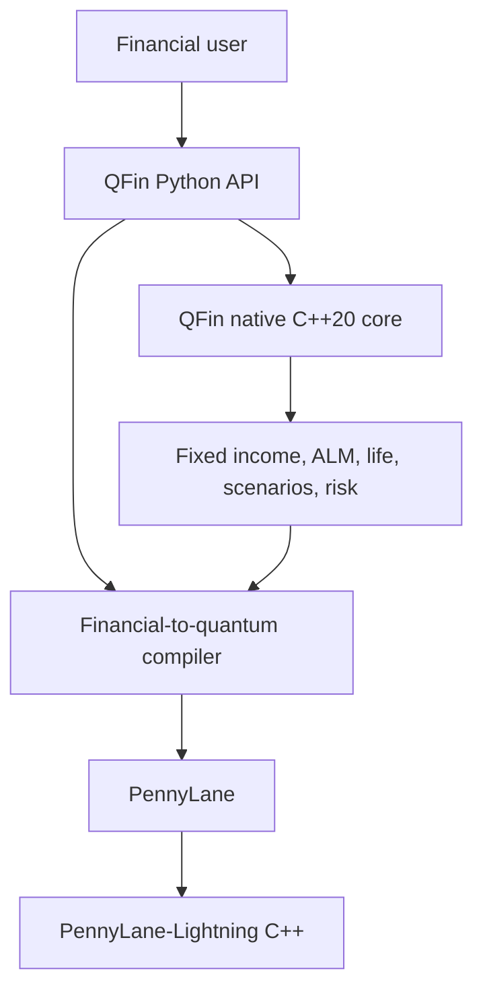

# QFin

[](https://github.com/venkatkota2/QFin/actions/workflows/ci.yml)

QFin is an experimental finance-specific modelling and compilation framework
for quantum computing. Users work with financial objects in Python. QFin maps
supported problems into classical calculations, quantum representations,
algorithms, circuits, and PennyLane devices while reporting which stages are
actually implemented.

Version `0.4.0` adds a QFin-owned C++20 financial core for batch fixed income,
ALM scenarios, life projections, yield solving, and tail-risk aggregation. It
preserves the existing European-option/MLAE pipeline and its default
PennyLane-Lightning simulator.

## Architecture



The two C++ components have separate responsibilities:

| Component | Responsibility |
| --- | --- |
| QFin C++ | Finance-specific cash-flow valuation, scenario repricing, actuarial projection, yield solving, and risk aggregation |
| PennyLane-Lightning C++ | State-vector simulation, quantum gate application, measurement, and circuit execution |

QFin does not implement a state-vector simulator and does not duplicate
PennyLane-Lightning.

## Install

```bash
python -m venv .venv
source .venv/bin/activate       # Windows: .venv\Scripts\activate
python -m pip install -e ".[quantum]"
```

Python 3.11 or newer is supported. Wheels produced by QFin include the native
extension without requiring the installer to run CMake. A source/editable build
needs a C++20 compiler; the build backend provisions CMake and pybind11
automatically.
NumPy/SciPy reference paths remain available through `engine="numpy"` and are
used as correctness oracles and for workloads where a native boundary crossing
does not help.

The distribution is named `qfin-quantum` because `qfin` is already occupied on
PyPI; the Python import remains `qfin`.

Inspect capabilities:

```python
import qfin

print(qfin.system_info())
# {
#   'native_extension': True,
#   'native_backend': 'qfin-native',
#   'native_cpp_standard': 'C++20',
#   'native_compiler': '<compiler id/version>',
#   'pennylane_lightning': True,
#   'preferred_quantum_device': 'lightning.qubit',
#   ...
# }
```

## Fixed income

```python
import qfin

curve = qfin.YieldCurve(
    times=[0, 1, 5, 10, 30],
    zero_rates=[0.02, 0.025, 0.03, 0.035, 0.04],
)
bonds = [
    qfin.FixedRateBond(maturity=5, coupon_rate=0.03, frequency=2),
    qfin.FixedRateBond(maturity=10, coupon_rate=0.04, frequency=2),
]

result = qfin.price_bonds(bonds, curve)
print(result.dirty_prices)
print(result.macaulay_duration)
print(result.convexity)
print(result.dv01)
```

The fixed-income layer supports fixed and zero-coupon cash flows, final stubs,
clean/dirty prices, accrued interest, curve pricing, price from yield, yield
from price, Macaulay/modified duration, convexity, DV01, and batch execution.
Rates are continuously compounded in `YieldCurve`; yield-to-maturity functions
use the bond's nominal coupon frequency.

## Asset-liability modelling

```python
assets = qfin.AssetPortfolio(bonds=bonds, quantities=[20, 15])
liabilities = qfin.LiabilityPortfolio.from_arrays(
    times=[3, 8, 15],
    amounts=[1_000, 2_000, 3_000],
)
alm = qfin.ALMModel(assets=assets, liabilities=liabilities, curve=curve)

base = alm.evaluate()
print(base.funding_ratio, base.duration_gap, base.convexity_gap)

scenarios = qfin.RateScenarioSet.parallel(curve, [-0.01, 0.0, 0.01])
stressed = alm.run_scenarios(scenarios, chunk_size=128)
print(stressed.surplus)
```

`duration_gap` uses the standard immunization definition
`D_assets - (L/A) D_liabilities`. Scenario execution accepts node-aligned rate
shock matrices and includes parallel, steepener/flattening, and triangular
key-rate constructors. Chunks bound temporary memory; the native kernel
aggregates portfolio PVs without materializing a scenario × instrument × cash
flow cube.

## Life projection

```python
import numpy as np

ages = np.arange(20, 121, dtype=float)
qx = np.minimum(0.0002 * np.exp(0.075 * (ages - 20)), 1.0)
mortality = qfin.MortalityTable(ages, qx)
policies = [
    qfin.LifePolicy(age=40, sum_assured=250_000, annual_premium=700, term=20)
]
assumptions = qfin.ProjectionAssumptions(
    mortality=mortality,
    curve=curve,
    lapse_rate=0.04,
    expense_per_policy=30,
)

projection = qfin.project_liabilities(policies, assumptions)
print(projection.present_value)
print(projection.expected_benefits)
```

The first life vertical slice is an annual-step term-life expected-cash-flow
model. Premiums and expenses occur at the start of each policy year; death
benefits occur at year end; mortality is applied before lapse. It supports
mortality categories, policy duration, survival, lapse, expenses, discounting,
aggregate cash flows, per-policy PVs, and conversion into an ALM liability
portfolio. It is a rigorous foundation, not a Prophet/AXIS/PathWise replacement.
Standalone mortality-table interpolation remains in NumPy because it benchmarks
faster there; C++ accelerates the batched policy-by-year projection loop.

## ALM to quantum representation

```python
scenario_result = alm.run_scenarios(scenarios)
losses = scenario_result.loss_distribution()
risk = qfin.CVaR(losses, confidence=0.995)
compiled = qfin.compile(risk, target_error=1.0)

print(compiled.run())
print(qfin.problem_capabilities(risk).to_dict())
```

Today, weighted VaR/CVaR executes classically through NumPy or QFin C++, and
the loss distribution can feed QFin's existing representation layer. QFin
reports that a quantum CVaR oracle/algorithm is unavailable; calling
`compiled.to_pennylane()` raises a clear `CompilationError`. This prevents an
unsupported problem from silently using a meaningless quantum workflow.

## European option quantum pipeline

```python
market = qfin.BlackScholes(spot=100, rate=0.04, volatility=0.20)
option = qfin.EuropeanCall(strike=105, maturity=1.0)
model = qfin.compile(option, market, target_error=0.10, max_qubits=8)

print(model.explain())
result = model.run(shots=2_000, schedule=(0, 1, 2, 4), seed=7)
print(result.value, result.classical_value, result.resources.to_dict())
```

The default circuit path remains:

1. Black-Scholes terminal lognormal model.
2. Inverse-CDF quantile representation.
3. Sparse tolerance-controlled Walsh/Pauli payoff synthesis.
4. Maximum-likelihood amplitude estimation.
5. `qml.device("lightning.qubit", ...)` execution when Lightning is installed.

Device selection defaults to `auto`, which prefers `lightning.qubit` and falls
back to `default.qubit` for a PennyLane-only installation.
`model.run(device_name="default.qubit")` remains an explicit portable override.
The structured and dense circuit backends remain numerical references.

## Performance and dispatch

`engine="auto"` selects a reference or native path only at conservative
workload thresholds. `engine="numpy"` and `engine="native"` are available for
validation and controlled benchmarking. Every native result is parity-tested
against its Python/NumPy reference. Tail-risk aggregation currently remains on
NumPy under `auto` because its native crossover was not stable; advanced users
can still request the native path explicitly.

See [docs/native-performance.md](docs/native-performance.md) for measured
end-to-end timings, numerical differences, and crossover behavior. Reproduce
the report with:

```bash
python examples/native_benchmark.py --full --repeats 3 \
  --output docs/native-performance.md
```

The report includes fixed-income batches, yield solving, base ALM portfolios,
policy projections, ALM scenarios, risk aggregation, and `default.qubit` versus
PennyLane-Lightning. It does not claim quantum advantage or promise a fixed
native speedup.

## Honest scope

QFin 0.4 is a research prototype. It does not yet support calibration,
path-dependent products, stochastic rates/volatility, credit instruments,
multi-state life products, dynamic policyholder behavior, production model
governance, hardware noise, Qiskit export, or a quantum VaR/CVaR algorithm.
Resource counts remain logical and pre-transpilation. Financial calculations
prioritize explicit assumptions, numerical parity, and transparent limitations.

## Development

```bash
python -m pip install -e ".[dev]"
ruff check .
mypy src/qfin
pytest --cov=qfin --cov-report=term-missing --cov-fail-under=78
python -m build
python examples/native_benchmark.py
```

More detail is available in [docs/architecture.md](docs/architecture.md),
[docs/circuit-design.md](docs/circuit-design.md), and
[docs/roadmap.md](docs/roadmap.md).
