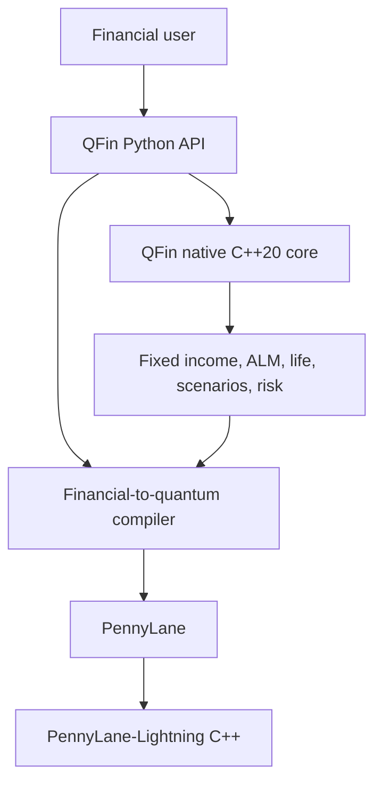

# QFin

[](https://github.com/venkatkota2/QFin/actions/workflows/ci.yml)

QFin is an experimental finance-specific modelling and compilation framework
for quantum computing. Users work with financial objects in Python. QFin maps
supported problems into classical calculations, quantum representations,
algorithms, circuits, and PennyLane devices while reporting which stages are
actually implemented.

Version `1.0.0` adds memory-bounded factorized VaR/CVaR references, hybrid MLAE
search over occupied reversible loss codes, and a reversible positive
tail-excess register whose bits reconstruct CVaR without a joint payoff table.
The 0.9 structured arithmetic, 0.8 scalable representation, 0.7 device realism,
and 0.6 ALM/life foundations remain intact. QFin-owned C++20 finance kernels
and the PennyLane-Lightning simulator remain separate components.

## Architecture



The two C++ components have separate responsibilities:

| Component | Responsibility |
| --- | --- |
| QFin C++ | Finance-specific cash-flow valuation, scenario repricing, actuarial projection, yield solving, and risk aggregation |
| PennyLane-Lightning C++ | State-vector simulation, quantum gate application, measurement, and circuit execution |

QFin does not implement a state-vector simulator and does not duplicate
PennyLane-Lightning.

## Install

```bash
python -m venv .venv
source .venv/bin/activate       # Windows: .venv\Scripts\activate
python -m pip install -e ".[quantum]"
```

Optional Qiskit circuit export is installed separately:

```bash
python -m pip install -e ".[quantum,qiskit]"
```

Python 3.11 or newer is supported. Wheels produced by QFin include the native
extension without requiring the installer to run CMake. A source/editable build
needs a C++20 compiler; the build backend provisions CMake and pybind11
automatically.
NumPy/SciPy reference paths remain available through `engine="numpy"` and are
used as correctness oracles and for workloads where a native boundary crossing
does not help.

The distribution is named `qfin-quantum` because `qfin` is already occupied on
PyPI; the Python import remains `qfin`.

Inspect capabilities:

```python
import qfin

print(qfin.system_info())
# {
#   'native_extension': True,
#   'native_backend': 'qfin-native',
#   'native_cpp_standard': 'C++20',
#   'native_compiler': '<compiler id/version>',
#   'pennylane_lightning': True,
#   'qiskit': True,
#   'preferred_quantum_device': 'lightning.qubit',
#   'tested_quantum_devices': (
#       'lightning.qubit', 'default.qubit', 'default.mixed'
#   ),
#   'factorized_state_preparation': True,
#   'structured_arithmetic_oracles': True,
#   'factorized_tail_risk': True,
#   'structured_factor_var_cvar': True,
#   'portfolio_optimization': 'classical-scipy',
#   'block_encoding_implemented': False,
#   'qsvt_implemented': False,
#   ...
# }
```

## Fixed income

Financial conventions are explicit and use Python's standard `datetime.date`
underneath:

```python
import qfin

calendar = qfin.Calendar(
    "portfolio calendar",
    holidays=frozenset({qfin.as_date("2027-01-01")}),
)
schedule = qfin.Schedule(
    "2026-01-31",
    "2031-01-31",
    frequency=2,
    calendar=calendar,
    business_day_convention="modified_following",
    end_of_month=True,
)
accrual = qfin.year_fraction(
    schedule.dates[0], schedule.dates[1], "30/360"
)

curve = qfin.YieldCurve(
    times=[0, 1, 5, 10, 30],
    zero_rates=[0.02, 0.025, 0.03, 0.035, 0.04],
    compounding="semiannual",
    interpolation="linear_zero",
    extrapolation="flat_zero",
    valuation_date="2026-01-31",
    day_count="ACT/365 Fixed",
)
print(curve.discount_date("2031-01-31"))
print(curve.explain())
```

See [docs/financial-conventions-1.1.md](docs/financial-conventions-1.1.md)
for exact convention definitions, interpolation behavior, diagnostics, and
current limitations.

```python
import qfin

curve = qfin.YieldCurve(
    times=[0, 1, 5, 10, 30],
    zero_rates=[0.02, 0.025, 0.03, 0.035, 0.04],
)
bonds = [
    qfin.FixedRateBond(maturity=5, coupon_rate=0.03, frequency=2),
    qfin.FixedRateBond(maturity=10, coupon_rate=0.04, frequency=2),
]

result = qfin.price_bonds(bonds, curve)
print(result.dirty_prices)
print(result.macaulay_duration)
print(result.convexity)
print(result.dv01)
```

The fixed-income layer supports fixed and zero-coupon cash flows, final stubs,
clean/dirty prices, accrued interest, curve pricing, price from yield, yield
from price, Macaulay/modified duration, convexity, DV01, and batch execution.
`YieldCurve` stores canonical continuously compounded rates for native-kernel
compatibility while retaining the input quote convention as metadata and
providing explicit quoted-rate conversion. Yield-to-maturity functions use the
bond's nominal coupon frequency.

## Asset-liability modelling

```python
import numpy as np

assets = qfin.AssetPortfolio(
    bonds=bonds,
    quantities=[20, 15],
    equity_value=5_000,
    cash_value=500,
)
liabilities = qfin.LiabilityPortfolio.from_arrays(
    times=[3, 8, 15],
    amounts=[1_000, 2_000, 3_000],
    inflation_linkage=[0.25, 0.5, 1.0],
)
alm = qfin.ALMModel(assets=assets, liabilities=liabilities, curve=curve)

base = alm.evaluate()
print(base.funding_ratio, base.duration_gap, base.convexity_gap)

scenarios = qfin.RateScenarioSet.parallel(curve, [-0.01, 0.0, 0.01])
stressed = alm.run_scenarios(scenarios, chunk_size=128)
print(stressed.surplus)

economic_paths = qfin.EconomicScenarioSet.correlated_gaussian(
    curve,
    scenario_count=1_000,
    periods=10,
    correlation=np.eye(6),
    standard_deviations=[0.0075, 0.003, 0.18, 0.012, 0.08, 0.12],
    means=[0, 0, 0.06, 0.025, 0, 0],
    seed=11,
)
paths = alm.project_paths(
    economic_paths,
    strategy=qfin.RebalancingStrategy(target_equity_weight=0.30),
)
print(paths.funding_ratio[:, -1])
```

`duration_gap` uses the standard immunization definition
`D_assets - (L/A) D_liabilities`. Scenario execution accepts node-aligned rate
shock matrices and includes parallel, steepener/flattening, and triangular
key-rate constructors. `EconomicScenarioSet` adds probability-aware economic
paths. One-period revaluation reports rates/spread/equity/inflation attribution
and sensitivities; multi-period execution models bond roll-down, reinvestment,
short-rate cash accrual, equity returns, liability payments, inflation linkage, target-weight
rebalancing, and transaction costs. Chunks bound temporary memory and native
kernels return portfolio aggregates without materializing a scenario ×
instrument × period cube.

## Life projection

```python
import numpy as np

ages = np.arange(20, 121, dtype=float)
qx = np.minimum(0.0002 * np.exp(0.075 * (ages - 20)), 1.0)
mortality = qfin.MortalityTable(ages, qx)
policies = qfin.PolicyModelPointSet(
    [
        qfin.LifePolicy(40, 250_000, 700, 20),
        qfin.LifePolicy(
            65,
            0,
            0,
            20,
            product_type="annuity",
            annual_benefit=12_000,
        ),
    ],
    counts=[5_000, 2_000],
)
assumptions = qfin.LifeAssumptionSet(
    mortality=mortality,
    curve=curve,
    lapse_rate=0.04,
    expense_per_policy=30,
    disability_rate=0.005,
    recovery_rate=0.20,
)

projection = qfin.project_liabilities(policies, assumptions)
print(projection.present_value)
print(projection.expected_benefits)
```

The annual-step foundation supports term, participating, universal-life, and
annuity model points; exact grouping with exposure counts; active, disabled,
and dead states; recovery, lapse, expenses, credited account values, bonuses,
surrenders, inflation-linked benefits, product PVs, sensitivities, and
conversion into an ALM liability portfolio. Premiums and expenses occur at the
start of each policy year and benefits at year end; mortality precedes
disability/recovery and lapse. `project_liability_scenarios` applies economic
and biometric paths while chunking both axes and returns scenario aggregates
that map directly into `LossDistribution`.

This is a rigorous extensible foundation, not a Prophet/AXIS/PathWise
replacement. Product semantics are intentionally simple and explicit.
Standalone mortality-table interpolation remains in NumPy because it
benchmarks faster there; C++ accelerates policy-by-year and
scenario-by-model-point-by-year loops.

See [docs/alm-life-0.6.md](docs/alm-life-0.6.md) for factor shapes, projection
ordering, product semantics, memory behavior, and explicit limitations.

## ALM to quantum risk

```python
scenario_result = alm.run_scenarios(scenarios)
losses = scenario_result.loss_distribution()
risk = qfin.CVaR(losses, confidence=0.995)
compiled = qfin.compile(risk, target_error=1.0)

classical = compiled.run()
quantum = compiled.run_quantum(
    shots=4_000,
    schedule=(0, 1, 2, 4),
    seed=7,
)

print(classical.cvar)
print(quantum.expected_shortfall)
print(quantum.value_at_risk)
print(quantum.resources.to_dict())
print(qfin.problem_capabilities(risk).to_dict())
```

`compiled.run()` remains the stable NumPy/QFin-native validation path.
`run_quantum()` executes the experimental PennyLane workflow: probability-tree
state preparation, MLAE CDF objectives, hybrid VaR threshold search, and an
MLAE tail-excess objective for CVaR. `TailProbability`, `VaR`, and `CVaR` are
separate public problem types.

The first empirical loader and objective multiplexer require
`O(2**data_qubits)` rotations. QFin reports that cost explicitly and makes no
quantum-advantage claim. See [docs/quantum-risk.md](docs/quantum-risk.md) for
the equations, confidence-interval semantics, and limitations.

Correlated multi-factor losses can be built with an explicit dependence model:

```python
import numpy as np
import qfin

factors = qfin.GaussianFactorModel(
    factor_names=("rates", "equity", "credit"),
    correlation=np.array(
        [[1.0, -0.2, 0.2], [-0.2, 1.0, -0.3], [0.2, -0.3, 1.0]]
    ),
)
scenarios = factors.simulate(10_000, seed=11, antithetic=True)
losses = scenarios.linear_loss_distribution([20_000, -4_000, 35_000])
```

This Gaussian linear-factor model is a transparent foundation, not an
assumption that real financial or insurance tails are Gaussian.

## Structured factor tail risk

Affine factor models can now feed a sparse financial loss oracle without
flattening the joint factor grid:

```python
factor_model = qfin.GaussianFactorModel(
    ("rates", "equity"),
    correlation=np.array([[1.0, -0.25], [-0.25, 1.0]]),
    means=np.array([0.02, 0.05]),
    standard_deviations=np.array([0.015, 0.12]),
)
encoding = qfin.encode_gaussian_factors(
    factor_model,
    qubits_per_factor=2,
    method="probability",
)
loss = qfin.SparseExposureObjective(
    linear={"rates": 100.0, "equity": 1.5},
    quadratic={("rates", "equity"): 10.0},
    piecewise=(qfin.HingeExposure("equity", 0.05, 0.75),),
)
risk = qfin.FactorTailProbability(
    qfin.FactorizedLossModel(encoding, loss),
    threshold=2.0,
)
compiled = qfin.compile(risk, target_error=0.05, backend="auto")

print(compiled.run().probability)
print(compiled.resources().to_dict())
```

QFin pulls constant, linear, and quadratic exposures back to the latent
integer registers. Positive-part terms use an out-of-place fixed-point affine
register, reversible comparison, and controlled addition. Exact encoded-grid
validation streams bounded chunks and never constructs the joint probability
or payoff table. The compiler separately allocates probability error to factor
transform quantization, payoff synthesis, and amplitude estimation.

The first structured compiler requires affine grids, so use
`method="probability"`; inverse-CDF quantile grids are rejected with an
actionable error. Arbitrary Python payoff callables are not silently converted
to exponential lookup tables. Arithmetic can be deeper than the generic
loader on tiny problems, and no quantum-advantage or hardware-runtime claim is
made. See [docs/structured-oracles-0.9.md](docs/structured-oracles-0.9.md).

## Structured factor VaR and CVaR

The same factorized loss model now feeds discrete VaR and CVaR directly:

```python
risk = qfin.FactorCVaR(
    qfin.FactorizedLossModel(encoding, loss),
    confidence=0.995,
)
compiled = qfin.compile(
    risk,
    target_error=100_000,
    backend="auto",
)

reference = compiled.run()
print(reference.var, reference.cvar)
print(compiled.resources().to_dict())

# Small research circuits only:
quantum = compiled.run_quantum(shots=2_000, schedule=(0, 1, 2))
print(quantum.value, quantum.classical_value)
```

The classical reference finds the exact encoded-grid quantile with repeated
bounded-memory CDF passes. Compilation validates a bounded histogram of loss
codes in financial units. Quantum VaR reuses one loss register across a hybrid
search of occupied codes. Quantum CVaR conditionally subtracts the selected
VaR into an excess register, estimates each excess bit with MLAE, and applies
the discrete tail-excess identity. Resource reports count every threshold,
excess bit, circuit, shot, oracle query, and the widest runtime.

This is an experimental simulator workflow. Its VaR interval combines local
MLAE intervals; its CVaR interval is conditional on the selected VaR and
combines marginal bit intervals. Neither is a simultaneous-coverage result.
See
[docs/structured-factor-risk-1.0.md](docs/structured-factor-risk-1.0.md).

## European option quantum pipeline

```python
market = qfin.BlackScholes(spot=100, rate=0.04, volatility=0.20)
option = qfin.EuropeanCall(strike=105, maturity=1.0)
model = qfin.compile(option, market, target_error=0.10, max_qubits=8)

print(model.explain())
result = model.run(shots=2_000, schedule=(0, 1, 2, 4), seed=7)
print(result.value, result.classical_value, result.resources.to_dict())
```

The default circuit path remains:

1. Black-Scholes terminal lognormal model.
2. Inverse-CDF quantile representation.
3. Sparse tolerance-controlled Walsh/Pauli payoff synthesis.
4. Maximum-likelihood amplitude estimation.
5. `qml.device("lightning.qubit", ...)` execution when Lightning is installed.

Device selection defaults to `auto`, which prefers `lightning.qubit` and falls
back to `default.qubit` for a PennyLane-only installation.
`model.run(device_name="default.qubit")` remains an explicit portable override.
The structured and dense circuit backends remain numerical references.

## Device realism and export

QFin now separates ideal runtime selection from portable target analysis:

```python
targeted = model.device_resources(
    schedule=(0, 1, 2, 4),
    shots=2_000,
    target="linear",
)
print(targeted.maximum_routed_depth)
print(targeted.circuits[-1].routing_swaps)

noise = model.noise_analysis(
    qfin.NoiseModel(
        depolarizing_probability=0.001,
        readout_bit_flip_probability=0.002,
    ),
    power=0,
)
print(noise.noisy_absolute_error, noise.mitigated_absolute_error)

qasm = model.to_openqasm(power=1, target="linear")
print(qasm.resources.objective_physical_wire, qasm.sha256)
qiskit_circuit = model.to_qiskit(power=1, target="linear")  # optional extra
```

The all-to-all and linear targets are synthetic research topologies using the
portable `RX/RY/RZ/CNOT` basis. They are not vendor hardware profiles. QFin
reports the logical-to-physical permutation and verifies every routed
two-qubit edge. Noise experiments use explicit local channels on
`default.mixed`; mitigation reports whether extrapolation actually improved
the selected run.

Only `lightning.qubit`, `default.qubit`, and `default.mixed` are registered as
tested. Additional device names are rejected until implemented and tested.
Qiskit support exports a `QuantumCircuit` and can inspect static BackendV2-style
capabilities; it does not authenticate or submit hardware work. See
[docs/device-realism-0.7.md](docs/device-realism-0.7.md).

## Scalable representations and optimization

Independent or latent factors can be encoded without constructing a joint
probability table:

```python
factor_model = qfin.GaussianFactorModel(
    ("rates", "equity", "inflation"),
    correlation,
    means=means,
    standard_deviations=volatilities,
)
encoding = qfin.encode_gaussian_factors(
    factor_model,
    qubits_per_factor=4,
)
strategy = qfin.compare_state_preparation_strategies(
    encoding,
    target=qfin.DeviceTarget.linear(encoding.total_qubits),
)
print(encoding.stored_marginal_points, encoding.joint_grid_points)
print(strategy.require_selected().to_dict())
```

`FactorizedPreparation` executes each marginal loader on its own register. A
small Cartesian product can be materialized behind an explicit guard for
validation, but the production loader does not require it. Gaussian
correlation remains lightweight affine metadata on the encoding. The 0.9
structured-tail compiler can synthesize it as reversible fixed-point
arithmetic when the marginals use affine probability grids; ordinary loading
does not allocate those work registers.

Portfolio optimization remains intentionally classical in 1.0:

```python
problem = qfin.MeanVarianceProblem(
    expected_returns=expected_returns,
    covariance=covariance,
    risk_aversion=3.0,
    asset_names=asset_names,
)
compiled = qfin.compile(problem)
result = compiled.run()
print(result.weights, result.utility_improvement)
print(compiled.block_encoding_feasibility().to_dict())
```

The compiler selects SciPy SLSQP (or the supported equality-constrained
closed form) because QFin has no implemented QUBO, variational optimizer,
block-encoding oracle, or QSVT circuit. Feasibility reports make this boundary
machine-readable. See
[docs/scalable-representation-0.8.md](docs/scalable-representation-0.8.md).

## Performance and dispatch

`engine="auto"` selects a reference or native path only at conservative
workload thresholds. `engine="numpy"` and `engine="native"` are available for
validation and controlled benchmarking. Every native result is parity-tested
against its Python/NumPy reference. Tail-risk aggregation currently remains on
NumPy under `auto` because its native crossover was not stable; advanced users
can still request the native path explicitly. Multi-period ALM also remains on
NumPy under `auto`: the final 0.6 measurements range from 0.88× to 1.09× and do
not establish a native crossover. Non-empty base and
scenario life projections select native execution when the extension is
available; even the measured one-policy, one-scenario, one-year case crossed
over in favor of C++.

See [docs/native-performance.md](docs/native-performance.md) for measured
end-to-end timings, numerical differences, and crossover behavior. Reproduce
the report with:

```bash
python examples/native_benchmark.py --full --repeats 3 \
  --output docs/native-performance.md
```

The report includes fixed-income batches, yield solving, base ALM portfolios,
policy projections, ALM scenarios, risk aggregation, and `default.qubit` versus
PennyLane-Lightning. It does not claim quantum advantage or promise a fixed
native speedup.

The separate [0.6 ALM/life performance report](docs/alm-life-performance.md)
measures the multi-period ALM and scenario-life kernels, including returned
array sizes and bounded life chunk estimates. Reproduce it with:

```bash
python examples/alm_life_benchmark.py --full --repeats 3 \
  --output docs/alm-life-performance.md
```

The separate [quantum-risk performance report](docs/quantum-risk-performance.md)
measures tail-probability, VaR, and CVaR circuits on `default.qubit` and
`lightning.qubit`. Reproduce it with:

```bash
python examples/quantum_risk_benchmark.py --repeats 3 --shots 1000 \
  --output docs/quantum-risk-performance.md
```

The [0.7 device-realism report](docs/device-realism-performance.md) records
ideal simulator parity, gate routing, synthetic noise/ZNE, OpenQASM export,
and Qiskit parsing from one reproducible environment:

```bash
python examples/device_realism_benchmark.py --repeats 5 \
  --output docs/device-realism-performance.md
```

The [0.8 scalable-representation report](docs/scalable-representation-performance.md)
measures factorized versus flattened construction, continuous portfolio
optimization, and classical feasibility analysis:

```bash
python examples/scalable_representation_benchmark.py --repeats 5 \
  --output docs/scalable-representation-performance.md
```

The [0.9 structured-oracle report](docs/structured-oracle-performance.md)
measures streamed construction, fixed-point numerical differences, guarded
generic comparisons after portable decomposition/routing, and
`default.qubit` versus `lightning.qubit` execution:

```bash
python examples/structured_oracle_benchmark.py --full --repeats 3 \
  --output docs/structured-oracle-performance.md
```

The [1.0 structured factor-risk report](docs/structured-factor-risk-performance.md)
measures the bounded-memory VaR/CVaR reference against a deliberately
materialized NumPy oracle and times the reusable threshold and excess-bit
circuits:

```bash
python examples/structured_factor_risk_benchmark.py
```

## Honest scope

QFin 1.0 is a research prototype. Its economic scenarios are foundations, not
calibrated ESG models; aggregate equity and spread exposures are deliberately
simple; life projection is annual and does not include production product
rules, dynamic policyholder behavior, tax, reserves, guarantees, or governance
workflows. QFin also does not yet support path-dependent derivatives,
stochastic-volatility calibration, credit instruments, calibrated hardware
noise, provider execution, efficient QRAM, or an end-to-end fault-tolerant risk
algorithm. The VaR search is hybrid and the CVaR interval is conditional on its
selected threshold. Portable target counts stop before pulse-level scheduling,
calibration, and error correction. Factorized loading does not remove the cost
of a general multivariate payoff oracle. Structured arithmetic is limited to
affine grids and sparse quadratic/positive-part objectives; it is not a general
payoff compiler. Block-encoding, QSVT, QUBO construction, and quantum portfolio
optimization are not implemented.

## Development

```bash
python -m pip install -e ".[dev]"
ruff check .
mypy src/qfin
pytest --cov=qfin --cov-report=term-missing --cov-fail-under=78
python -m build
python examples/native_benchmark.py
python examples/alm_life_benchmark.py
python examples/quantum_risk_benchmark.py --repeats 1 --shots 500
python examples/device_realism.py
python examples/device_realism_benchmark.py --repeats 1
python examples/scalable_representation.py
python examples/scalable_representation_benchmark.py --repeats 1
python examples/structured_factor_tail.py
python examples/structured_oracle_benchmark.py --repeats 1
python examples/structured_factor_risk.py
python examples/structured_factor_risk_benchmark.py
```

More detail is available in [docs/architecture.md](docs/architecture.md),
[docs/circuit-design.md](docs/circuit-design.md),
[docs/device-realism-0.7.md](docs/device-realism-0.7.md),
[docs/scalable-representation-0.8.md](docs/scalable-representation-0.8.md),
[docs/structured-oracles-0.9.md](docs/structured-oracles-0.9.md),
[docs/structured-factor-risk-1.0.md](docs/structured-factor-risk-1.0.md),
[docs/quantum-risk.md](docs/quantum-risk.md), and
[docs/roadmap.md](docs/roadmap.md).
