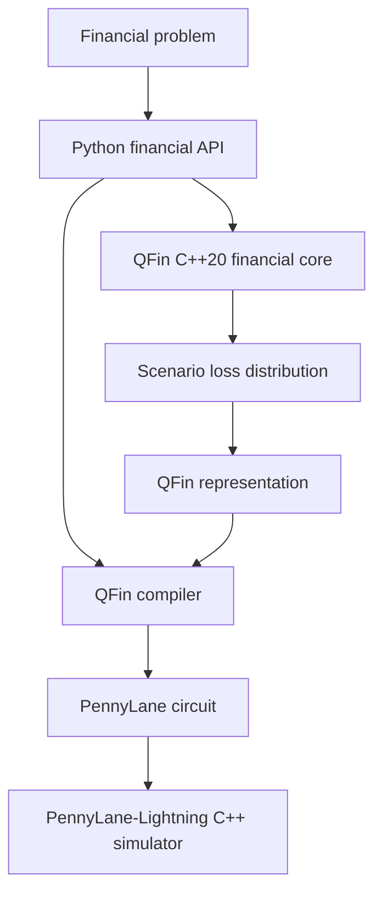
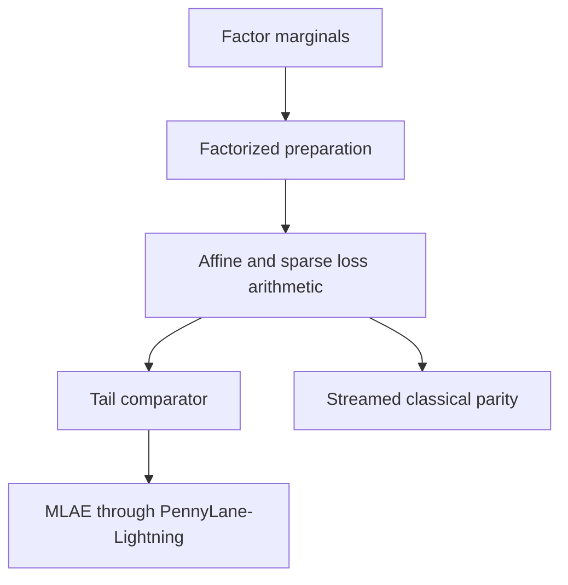
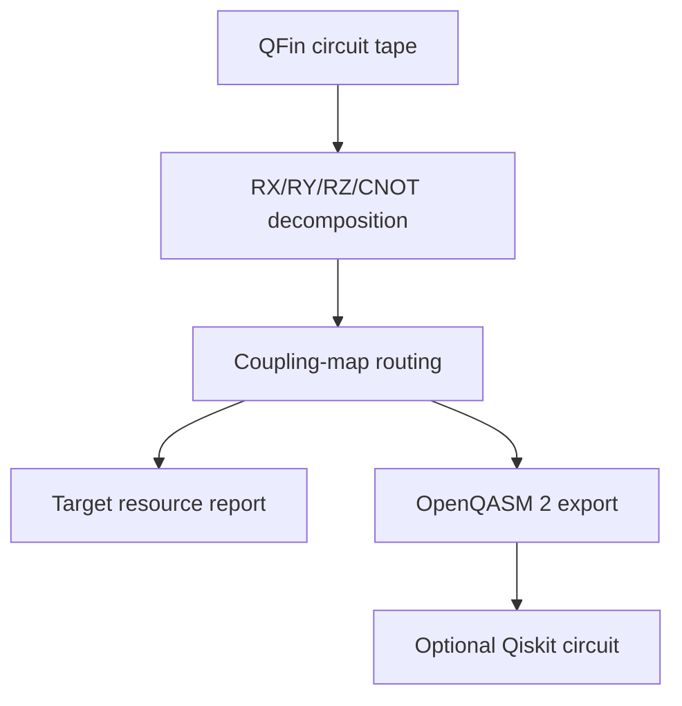
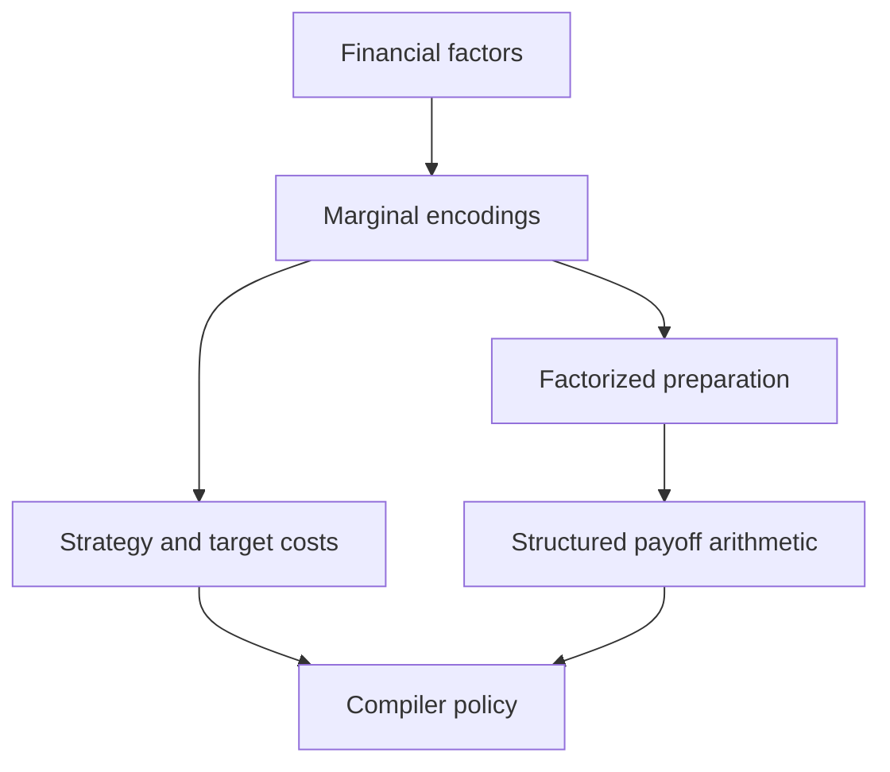

# Architecture

QFin is one Python package with two compiled execution dependencies serving
different roles.



## Responsibility boundaries

### Python

- public financial API and immutable domain objects;
- input validation and user-facing errors;
- compiler, capability, and representation policy;
- backend and algorithm selection;
- reporting and classical/native parity references;
- PennyLane circuit construction and resource estimates.

### QFin-owned C++20

- flattened cash-flow batch pricing and rate moments;
- price/yield batches and robust bounded yield solving;
- portfolio-level valuation under node-aligned scenario matrices;
- multi-period ALM roll-forward, reinvestment, payments, and rebalancing;
- product/state policy × projection-year cash-flow loops;
- chunked scenario × model-point × projection-year aggregation;
- weighted loss-distribution and expected-shortfall aggregation.

### PennyLane and PennyLane-Lightning

PennyLane owns the device/circuit abstraction. Lightning applies quantum gates,
evolves state vectors, and samples measurements through its compiled C++
implementation. QFin does not implement these kernels.

## Native boundary

`qfin._native` is private. Public functions accept Python financial objects,
validate them, build contiguous NumPy buffers, and cross into C++ once per
batch or chunk. C++ calls release the GIL during numerical work and return
preallocated arrays. No API calls C++ once per bond, policy, scenario, cash
flow, or time step.

The reference path remains available with `engine="numpy"`. It provides an
independent correctness oracle and is often faster for small vectorized work.
`engine="native"` is an explicit override. `engine="auto"` uses conservative
thresholds established by the reproducible benchmark rather than by language
preference.

Sort-heavy tail-risk aggregation currently remains on NumPy under `auto`
because the measured native crossover was not stable. The C++ implementation
is retained as an explicit, parity-tested path for continued profiling.
Multi-period ALM likewise stays on NumPy under `auto`: final measured 0.6
speedups range from 0.88× to 1.09× and do not establish a native crossover.
Base and scenario life projection use native execution for any
non-empty workload when the extension is available; the smallest measured
one-policy, one-scenario, one-year workload was already faster in C++.

Curve interpolation and standalone mortality-table interpolation remain in
NumPy: their existing vectorized kernels benchmark faster than a separate
QFin-native boundary crossing. They still execute inside C++ when embedded in
the larger pricing, scenario, or policy-projection kernels.

## Curves and fixed income

`YieldCurve` stores strictly increasing year fractions and continuously
compounded zero rates. The first implementation uses linear interpolation and
flat extrapolation. Curve objects are reused during portfolio/scenario calls;
the native kernel never reconstructs a curve for each instrument.

`FixedRateBond` emits regular coupons plus a possible final stub and principal.
Curve valuation computes

```text
PV = sum_i CF_i exp(-r(t_i) t_i).
```

The first and second parallel-shift derivatives produce duration, convexity,
and DV01. Yield-to-maturity functions use nominal compounding at each bond's
coupon frequency and a monotone bisection bounded above the singular lower
yield. Convergence is reported per instrument.

## ALM and economic scenarios

`AssetPortfolio`, `LiabilityPortfolio`, and `ALMModel` separate financial
objects from execution. Base evaluation reports PVs, surplus/deficit, funding
ratio, durations, convexities, and scaled immunization gaps.

`RateScenarioSet` preserves one-period additive curve shocks.
`EconomicScenarioSet` stores validated scenario × period paths for additive
zero-rate and credit-spread shocks, equity and inflation rates, and mortality
and lapse multipliers. It also carries normalized scenario probabilities,
labels, period length, and an explicit dependence-assumption description. Its
correlated-Gaussian constructor is a transparent research generator, not a
calibrated economic-scenario model.

One-period factor revaluation isolates rate, spread, equity, and inflation
effects and reports the exact interaction residual. Multi-period ALM projects
bond roll-down and cash-flow reinvestment, short-rate cash accrual, aggregate equity returns,
inflation-indexed liabilities, liability payments, target-weight rebalancing,
and transaction costs. Python chunks the scenario axis; the C++ kernel returns
only scenario × period portfolio aggregates. It does not allocate an
instrument-level result cube.

## Life projection semantics

The annual engine handles term, participating, universal-life, and annuity
model points. `PolicyModelPointSet` groups exactly equal policies and retains
positive exposure counts, so a large book can be represented without
duplicating projection work. `LifeAssumptionSet` is the public semantic alias
for the named mortality, decrement, recovery, expense, crediting, inflation,
premium, and benefit assumptions.

Each annual step follows an explicit ordering:

1. opening in-force pays annual premium and incurs annual expense at time `t`;
2. universal-life account values receive premium, charge, and credited return;
3. mortality is applied to active and disabled states;
4. disability incidence and recovery move surviving lives between states;
5. lapse is applied to remaining active and disabled lives; and
6. death, disability, annuity, surrender, and maturity benefits are paid at
   `t + 1` according to the selected product foundation.

Outputs include aggregate premiums, benefits, expenses, net insurer liability
cash flows, active/disabled/death counts, model-point PVs, product PVs,
portfolio PV, and duration. The scenario engine applies rate, inflation,
mortality, and lapse paths in bounded scenario and model-point chunks and
returns only scenario-level premiums, benefits, expenses, surrenders, and PVs.
No scenario × policy × time output cube is allocated.

These products are extensible actuarial foundations with annual expected-value
semantics, not production contract implementations. Mortality/lapse extremes,
product analytical cases, model-point grouping, chunk invariance, and
Python/native parity are tested explicitly.

## Risk and compiler integration

`ALMScenarioResult`, `ALMFactorScenarioResult`, and `ALMPathResult` map surplus
deterioration into `LossDistribution`. `LifeScenarioResult` maps increases in
liability PV into the same representation boundary. Financial models remain
classical/native preprocessing: users explicitly create `TailProbability`,
`VaR`, or `CVaR` problems from those loss distributions before compiling.

Weighted VaR uses the first discrete loss whose cumulative probability reaches
the requested confidence. Expected shortfall integrates the worst
`1-confidence` probability mass, fractionally allocating mass at the VaR
boundary.

`qfin.compile(...)` now has separate policies for `TailProbability`, `VaR`,
and `CVaR`:

- the original finite loss distribution remains the classical reference;
- candidate empirical encodings are checked directly against the requested
  risk statistic before qubit selection converges;
- a generic probability tree prepares scenario probabilities;
- exact grid-point indicator or normalized-excess objectives rotate one
  objective qubit;
- MLAE estimates each objective through PennyLane;
- VaR uses hybrid binary search across occupied encoded loss points; and
- CVaR estimates tail excess after the VaR threshold search.

`compiled.run()` remains classical and `compiled.run_quantum()` selects the
experimental circuit workflow explicitly. The compiler does not route risk
problems through an option-pricing circuit.

The risk resource report includes quantum circuits, shots, oracle queries,
state-preparation rotations, classical input/encoded sizes, estimated sorting
work, and preprocessing memory. Generic empirical loading remains
`O(2**data_qubits)`; no efficient QRAM or hardware advantage is implied.

`GaussianFactorModel` adds a validated, reproducible Gaussian correlation
assumption for multi-factor scenario generation. It is deliberately separate
from the quantum representation so calibrated copulas, heavy-tailed marginals,
and nonlinear portfolio revaluation can replace it later.

## Structured factor tail-risk compiler

`FactorizedLossModel` combines a factorized encoding with a
`SparseExposureObjective`. The objective admits a constant, named sparse
linear and quadratic terms, and explicit univariate positive parts. This
bounded algebra is deliberate: QFin never hides an arbitrary multivariate
callable behind an exponential payoff lookup table.

For affine probability grids, the compiler expresses polynomial exposures in
the latent basis-state integers. Positive-part terms compile the required
observed factor into an out-of-place fixed-point register, use
`IntegerComparator` to mark the active branch, and apply a controlled
`OutPoly` addition to the loss register. A second comparator marks whether the
loss crosses the requested tail threshold. The state preparation, arithmetic,
and comparator form the `A` operator used by the existing MLAE Grover iterate.



Register widths are calculated over the complete encoded integer domain so
unsigned modular arithmetic cannot wrap in a valid basis state. Fixed-point
precision is increased until the probability mass whose exact and quantized
tail classifications disagree fits the combined transform/payoff budget, or a
resource guard stops compilation. The classical reference streams the full
encoded domain in chunks. This bounds memory but does not change exponential
validation time.

`backend="auto"` selects PennyLane only when arithmetic convergence, state
preparation, target width, monomial count, and runtime width all pass. An
explicit PennyLane request raises on an unmet condition; it never silently
relabels a classical result as quantum. Target comparison against the generic
empirical loader is available only behind an explicit small joint-grid guard.

## Existing option circuit

The v0.3 compressed circuit remains unchanged. For grid labels `x_i`,
probabilities `p_i`, and normalized payoff `f_i`, QFin prepares an objective
amplitude representing `sum_i p_i f_i`, applies Grover powers, and fits the
amplitude with MLAE. Quantile loading uses Hadamards; sparse Walsh/Pauli terms
approximate payoff rotations. Compiler-facing device selection defaults to
`auto`: it resolves to `lightning.qubit` when installed and otherwise to
PennyLane's `default.qubit`.

## Device-realism boundary

QFin 0.7 adds a compiler-analysis path after circuit construction:



`DeviceTarget` contains only portable basis and connectivity assumptions. The
built-in all-to-all and line graphs are synthetic; they are not calibration
snapshots. Every final two-qubit gate is checked against the target edges, and
the report retains the final logical-to-physical map so an exported objective
measurement remains interpretable after SWAP routing.

Noise is a separate analysis path. `default.mixed` executes explicitly inserted
local depolarizing and readout bit-flip channels. Global unitary folding and
polynomial zero-noise extrapolation report both unmitigated and mitigated error
against the ideal circuit. No QFin C++ code applies quantum gates or channels.

OpenQASM export requires PennyLane but not Qiskit. The optional Qiskit extra
parses that program into a `QuantumCircuit`. Provider capability inspection is
read-only: it checks static width, operations, connectivity, and control-flow
signals without credentials, calibration access, transpilation, or execution.

## Scalable representation and optimization policy

QFin 0.8 introduces independent latent registers as a second multivariate
representation boundary:



The circuit loader composes existing marginal Hadamard or probability-tree
preparations and never allocates a joint angle table. A Gaussian correlation
map can be attached as basis-state interpretation metadata. The 0.9 compiler
can synthesize that map on affine probability grids. General payoff evaluation
is still not silently flattened behind this interface.

Strategy reports compare implemented loaders under wire, parameter, memory,
and portability limits. The option compiler caps qubit search to target width;
the risk compiler can select its classical path under `backend="auto"` when a
generic loader cannot fit. Explicit PennyLane requests fail instead of
ignoring the constraint.

`MeanVarianceProblem` enters the same compiler as a financial problem but is
routed to a continuous SciPy baseline. Block-encoding and QSVT analysis records
matrix preconditions separately from implementation flags. This prevents a
PSD covariance matrix from being mistaken for an available quantum optimizer.

## Errors, memory, and threads

C++ validates buffer shapes, finite inputs, ordered offsets, probabilities,
curve grids, and solver controls. Standard C++ exceptions translate to Python
exceptions; public validation normally fails before entering native code.

The first native release is single-threaded and portable. This avoids
oversubscription with NumPy/BLAS and PennyLane-Lightning while benchmark data is
still being collected. Release builds use standard compiler optimization and
auto-vectorization. OpenMP/SIMD/GPU work remains a benchmark-driven future path.
