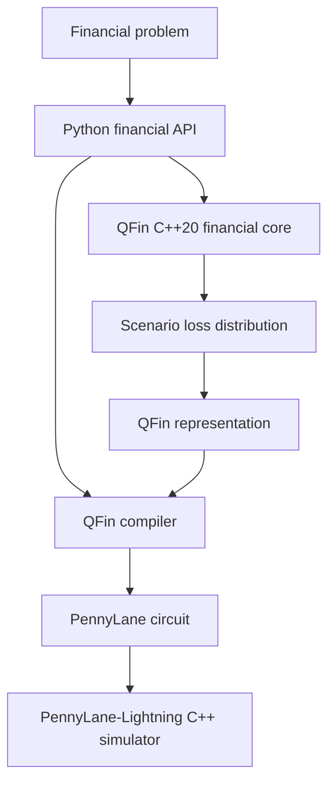

# Architecture

QFin is one Python package with two compiled execution dependencies serving
different roles.



## Responsibility boundaries

### Python

- public financial API and immutable domain objects;
- input validation and user-facing errors;
- compiler, capability, and representation policy;
- backend and algorithm selection;
- reporting and classical/native parity references;
- PennyLane circuit construction and resource estimates.

### QFin-owned C++20

- flattened cash-flow batch pricing and rate moments;
- price/yield batches and robust bounded yield solving;
- portfolio-level valuation under node-aligned scenario matrices;
- policy × projection-year mortality/lapse/cash-flow loops;
- weighted loss-distribution and expected-shortfall aggregation.

### PennyLane and PennyLane-Lightning

PennyLane owns the device/circuit abstraction. Lightning applies quantum gates,
evolves state vectors, and samples measurements through its compiled C++
implementation. QFin does not implement these kernels.

## Native boundary

`qfin._native` is private. Public functions accept Python financial objects,
validate them, build contiguous NumPy buffers, and cross into C++ once per
batch or chunk. C++ calls release the GIL during numerical work and return
preallocated arrays. No API calls C++ once per bond, policy, scenario, cash
flow, or time step.

The reference path remains available with `engine="numpy"`. It provides an
independent correctness oracle and is often faster for small vectorized work.
`engine="native"` is an explicit override. `engine="auto"` uses conservative
thresholds established by the reproducible benchmark rather than by language
preference.

Sort-heavy tail-risk aggregation currently remains on NumPy under `auto`
because the measured native crossover was not stable. The C++ implementation
is retained as an explicit, parity-tested path for continued profiling.

Curve interpolation and standalone mortality-table interpolation remain in
NumPy: their existing vectorized kernels benchmark faster than a separate
QFin-native boundary crossing. They still execute inside C++ when embedded in
the larger pricing, scenario, or policy-projection kernels.

## Curves and fixed income

`YieldCurve` stores strictly increasing year fractions and continuously
compounded zero rates. The first implementation uses linear interpolation and
flat extrapolation. Curve objects are reused during portfolio/scenario calls;
the native kernel never reconstructs a curve for each instrument.

`FixedRateBond` emits regular coupons plus a possible final stub and principal.
Curve valuation computes

```text
PV = sum_i CF_i exp(-r(t_i) t_i).
```

The first and second parallel-shift derivatives produce duration, convexity,
and DV01. Yield-to-maturity functions use nominal compounding at each bond's
coupon frequency and a monotone bisection bounded above the singular lower
yield. Convergence is reported per instrument.

## ALM and scenarios

`AssetPortfolio`, `LiabilityPortfolio`, and `ALMModel` separate financial
objects from execution. Base evaluation reports PVs, surplus/deficit, funding
ratio, durations, convexities, and scaled immunization gaps.

Rate scenarios are additive shocks at the curve nodes. The C++ scenario kernel
streams across scenarios and cash flows and returns portfolio-level PVs. Python
chunks the scenario axis to bound working memory. The implementation does not
allocate a portfolio × scenario × risk-factor × time cube.

## Life projection semantics

The first policy kernel handles annual term-life projections:

1. opening in-force pays annual premium and incurs annual expense at time `t`;
2. mortality is applied over the policy year;
3. death benefit is paid at `t + 1`;
4. lapse is applied to survivors;
5. remaining in-force advances to the next year.

Outputs include aggregate premiums, benefits, expenses, net insurer liability
cash flows, opening in-force counts, per-policy PVs, portfolio PV, and duration.
Mortality and lapse edge cases (`0`, `1`, multipliers, table tails) are covered
by Python/native parity tests.

## Risk and compiler integration

An `ALMScenarioResult` maps surplus deterioration into `LossDistribution`.
Weighted VaR uses the first discrete loss whose cumulative probability reaches
the requested confidence. Expected shortfall integrates the worst
`1-confidence` probability mass, fractionally allocating mass at the VaR
boundary.

`qfin.compile(...)` now has separate policies for `TailProbability`, `VaR`,
and `CVaR`:

- the original finite loss distribution remains the classical reference;
- candidate empirical encodings are checked directly against the requested
  risk statistic before qubit selection converges;
- a generic probability tree prepares scenario probabilities;
- exact grid-point indicator or normalized-excess objectives rotate one
  objective qubit;
- MLAE estimates each objective through PennyLane;
- VaR uses hybrid binary search across occupied encoded loss points; and
- CVaR estimates tail excess after the VaR threshold search.

`compiled.run()` remains classical and `compiled.run_quantum()` selects the
experimental circuit workflow explicitly. The compiler does not route risk
problems through an option-pricing circuit.

The risk resource report includes quantum circuits, shots, oracle queries,
state-preparation rotations, classical input/encoded sizes, estimated sorting
work, and preprocessing memory. Generic empirical loading remains
`O(2**data_qubits)`; no efficient QRAM or hardware advantage is implied.

`GaussianFactorModel` adds a validated, reproducible Gaussian correlation
assumption for multi-factor scenario generation. It is deliberately separate
from the quantum representation so calibrated copulas, heavy-tailed marginals,
and nonlinear portfolio revaluation can replace it later.

## Existing option circuit

The v0.3 compressed circuit remains unchanged. For grid labels `x_i`,
probabilities `p_i`, and normalized payoff `f_i`, QFin prepares an objective
amplitude representing `sum_i p_i f_i`, applies Grover powers, and fits the
amplitude with MLAE. Quantile loading uses Hadamards; sparse Walsh/Pauli terms
approximate payoff rotations. Compiler-facing device selection defaults to
`auto`: it resolves to `lightning.qubit` when installed and otherwise to
PennyLane's `default.qubit`.

## Errors, memory, and threads

C++ validates buffer shapes, finite inputs, ordered offsets, probabilities,
curve grids, and solver controls. Standard C++ exceptions translate to Python
exceptions; public validation normally fails before entering native code.

The first native release is single-threaded and portable. This avoids
oversubscription with NumPy/BLAS and PennyLane-Lightning while benchmark data is
still being collected. Release builds use standard compiler optimization and
auto-vectorization. OpenMP/SIMD/GPU work remains a benchmark-driven future path.
