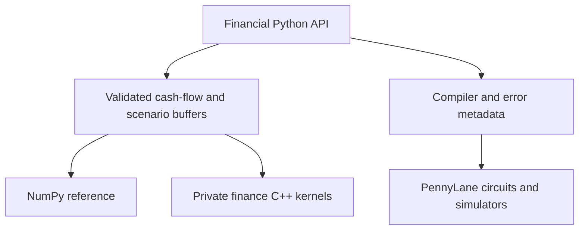

# Architecture

QFin keeps financial objects, validation, algorithm selection, orchestration,
compiler decisions and PennyLane integration in Python. Private C++20 kernels
consume contiguous batched buffers for existing finance arithmetic. PennyLane
and PennyLane-Lightning own quantum simulation; QFin does not duplicate them.

`engine="auto"` is an implementation choice within a financial methodology.
Explicit `engine="native"` rejects unsupported curve semantics. Native curve
valuation currently requires linear continuously compounded zero interpolation
and flat-zero extrapolation. Other supported curves use NumPy. See
[dispatch evidence](performance.md).

`numpy`, `native` and `mixed` identify the arithmetic behind reported analytics.
Small final scalar identities and Python object construction do not alone make a
native result mixed. Substantive analytics or projections performed in both
engines do. For example, native policy cash-flow projection with NumPy-derived
portfolio analytics reports mixed. A native extension being installed is not
proof that a particular result used it.

Scenario preparation caches cash-flow times, amounts, offsets and interpolation
indices. Scenario-dependent interpolation retains each curve's methodology.
Key-rate execution generates schedules once and batches the node shocks. Large
native scenario outputs are allocated as NumPy-owned contiguous memory before
compute; no capsule lifetime tricks are used. Small vector results retain simple
copies where ownership clarity outweighs potential bandwidth savings.

Public immutable model arrays own their storage; constructors do not freeze a
caller's ndarray. Integer controls use `operator.index` semantics and reject
booleans and floating-point coercion. Private helper structures and
`qfin._qfin_native` are not a public compatibility contract.

Finance C++ remains single threaded. NumPy/BLAS and PennyLane may have their own
thread settings. Seeded generators are local; hidden global RNG state is not
used to select scenarios or compiler decisions.

## 1.1.2 reliability boundaries

Internal compiler validation is normalized by the frozen `_config.CompileConfig`;
public `compile(...)` parameters and defaults are unchanged. `_dispatch.py` owns
static classical engine decisions. Native checked-size and finite-result headers
are shared by the existing financial kernels. The binding remains an adapter for
validation, spans, GIL release and owned arrays; no financial implementation was
moved into it. A wider binding split was not needed for these focused changes.
See [exceptions](exceptions.md), [memory](memory.md) and [reproducibility](reproducibility.md).
