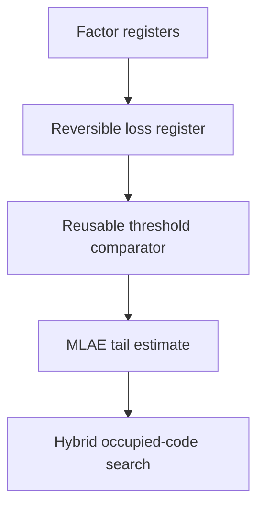

# Structured factorized VaR and CVaR (1.0)

QFin 1.0 extends the 0.9 reversible factor loss register into executable
factorized VaR and CVaR workflows. It does not introduce another simulator or
an arbitrary payoff table. QFin constructs finance-specific arithmetic and
hybrid risk logic in Python/PennyLane; PennyLane-Lightning continues to execute
the state-vector circuits.

## Public problems

`FactorVaR` and `FactorCVaR` accept a `FactorizedLossModel` and confidence
level. They complement `FactorTailProbability`:

```python
loss_model = qfin.FactorizedLossModel(encoding, sparse_exposure)
problem = qfin.FactorCVaR(loss_model, confidence=0.995)
compiled = qfin.compile(problem, target_error=100_000, backend="auto")

reference = compiled.run()
quantum = compiled.run_quantum(shots=2_000, schedule=(0, 1, 2))
```

The public API never exposes a parallel C++ or binding-level risk model.
`problem_capabilities` identifies this as an implemented experimental
structured quantum workflow while retaining the classical streamed reference.

## Memory-bounded classical reference

Weighted discrete VaR is the first loss whose CDF reaches the confidence level.
`evaluate_factor_risk` finds it with a monotone binary search over the ordered
64-bit IEEE-754 domain. Every CDF evaluation streams mixed-radix factor chunks;
it does not allocate a joint loss/probability table. Expected shortfall uses

```text
CVaR_alpha = VaR_alpha + E[max(L - VaR_alpha, 0)] / (1 - alpha).
```

This algorithm intentionally exchanges repeated passes for bounded memory.
The result reports CDF evaluations, chunks, and total streamed point visits so
that the validation cost is visible. It is a correctness oracle, not a faster
replacement for a materialized NumPy sort when a small joint grid comfortably
fits memory.

## Fixed-point validation

The 0.9 arithmetic compiler still produces one unsigned loss register. For
VaR/CVaR, validation streams the factor domain once into a bounded histogram
of at most `2**loss_qubits` codes. It then compares exact and fixed-point VaR
and CVaR in financial units. No factor-state or payoff row is stored per joint
point.

`StructuredRiskErrorBudget` allocates:

| Source | Allocation |
| --- | ---: |
| Fixed-point loss quantization | 40% |
| Hybrid search and MLAE estimation | 60% |

Automatic precision tries power-of-two scales from 1 through 4096 and accepts
the first fixed-point VaR or CVaR within the quantization allocation. Explicit
scales remain available for reproducible experiments. Loss width, affine
width, monomial count, state-preparation parameters/memory, target wires, and
total simulator wires remain hard guards.

## Structured VaR search

The compiler reuses the compiled loss arithmetic for every threshold. It
searches only occupied loss codes. At a candidate code `v`, one comparator
marks `loss >= v + 1`; MLAE estimates that upper tail and the hybrid controller
uses its complement as `CDF(v)`.



The result retains every local amplitude estimate, the selected loss code,
and a monotonicity-derived VaR interval. That interval combines marginal MLAE
intervals and is not a simultaneous-coverage guarantee.

## Reversible CVaR tail excess

After selecting VaR code `v`, QFin creates a same-width work register and
computes

```text
e = max(loss_code - v, 0)
```

with a comparator and controlled out-of-place polynomial subtraction. The
branch comparator is uncomputed. Rather than loading an exponential rotation
table, QFin estimates the probability of each excess-register bit with the
same Grover/MLAE machinery and reconstructs

```text
E[e] = sum_b 2**b P(e_b = 1).
```

The fixed-point scale converts expected ticks back to financial units before
the discrete CVaR identity is applied. This requires one objective per loss
bit. Resource reports include all VaR thresholds, excess bits, circuits,
shots, oracle queries, and the wider excess-register circuit. CVaR intervals
are conditional on the selected VaR and conservatively combine per-bit
intervals; they are not joint statistical intervals.

## Backend policy and responsibilities

`backend="auto"` selects PennyLane only when fixed-point parity, state
preparation, parameter/memory limits, monomial limits, and the widest required
circuit all pass. Otherwise it selects the streamed classical path.
`backend="pennylane"` raises an actionable resource error when a requirement is
not met.

| Component | Work performed |
| --- | --- |
| QFin Python | financial objects, validation, fixed-point compilation, hybrid search, resource/error reports |
| QFin C++20 | existing classical financial/actuarial kernels; not used as a quantum simulator |
| PennyLane | circuit/device abstraction and arithmetic operations |
| PennyLane-Lightning C++ | state-vector gate application and measurement simulation |

## Implemented boundaries

Implemented in 1.0:

- exact streamed factor-grid VaR/CVaR;
- fixed-point VaR/CVaR parity in financial units;
- occupied-code hybrid VaR search;
- reusable threshold comparators over one loss register;
- reversible positive tail-excess subtraction;
- bitwise excess MLAE and CVaR reconstruction;
- logical and target-decomposed workload reports;
- deterministic backend fallback and resource guards; and
- `default.qubit`/`lightning.qubit` parity tests.

Not implemented:

- a coherent all-quantum quantile search;
- simultaneous-coverage VaR or CVaR confidence intervals;
- arbitrary nonlinear multivariate payoff compilation;
- QRAM, amplitude loading of an externally materialized portfolio cube, or a
  state-vector simulator;
- calibrated hardware execution or fault-tolerant synthesis; or
- a quantum runtime or advantage claim.

Run the public example and reproduce the benchmark with:

```bash
python examples/structured_factor_risk.py
python examples/structured_factor_risk_benchmark.py
```

Measured results and the exact environment are recorded in
[`structured-factor-risk-performance.md`](structured-factor-risk-performance.md).
